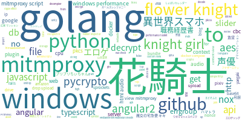

wordcloud-google-activity
==================


Generating WordCloud of your search activity on Google (Japan).

Inspired by https://github.com/Silver-birder/google-word-cloud

## Usage

- Download your activity archive as **JSON** from [Download your data on Google](https://takeout.google.com) 
- Unzip archive and use following commands

```
cd wordcloud-google-activity
pipenv run python main.py /path/to/アクティビティ.json output.png
open output.png
```

### Search Period

Open `main.py` and edit `begin` and `end` to specify period.

```python
begin = parse("2018-01-01")
end = parse("2018-03-01")
```

### Negative keywords

You can specify negative keywords with adding `stopwords=` to `WordCloud` constructor.

```python
wc = WordCloud(..., stopwords={'foo', 'bar'})
```